# 🚀 Customer Churn ML Pipeline

A compact end-to-end training pipeline for customer churn prediction using the IBM Telco Customer Churn dataset.

The project is intentionally small, but structured like a real training workflow: data ingestion, validation, preprocessing, model training, evaluation, artifact generation, and batch prediction.

## 🚀 At A Glance

```mermaid
flowchart LR
configStep[ConfigAndCLI] --> ingestStep[LoadOrDownloadDataset]
ingestStep --> validateStep[ValidateAndProfileData]
validateStep --> driftStep[DriftMonitoring]
driftStep --> prepStep[PreprocessFeatures]
prepStep --> splitStep[TrainTestSplit]

splitStep --> tuneStep[RayTuneHyperparamSearch]
tuneStep --> skStep[TrainSklearnModels]
splitStep --> torchStep[TrainTorchMLP]

skStep --> compareStep[CompareMetricsAndSelectModel]
torchStep --> compareStep

compareStep --> metricsStep[WriteMetricsAndReports]
metricsStep --> modelStep[SaveSelectedModel]
modelStep --> predictStep[BatchPredictionEntry]
```



- dataset: IBM Telco Customer Churn
- task: binary classification
- target: `Churn`
- models: `logistic_regression`, `random_forest`, `torch_mlp`
- selection metric: `f1`

## 🧰 What The Repository Covers

- config-driven training runs
- schema and data-quality validation
- shared preprocessing for numeric and categorical features
- sklearn and PyTorch baseline comparison
- Ray Tune hyperparameter search
- cross-validation and threshold analysis
- drift monitoring between runs
- per-run artifacts and run manifest
- simple batch prediction entrypoint
- tests, CI, and multi-stage Docker

## 📊 Current Result

The latest run selects `random_forest` as the best model by held-out test `f1`, after Ray Tune hyperparameter search.

| Model | Accuracy | Precision | Recall | F1 | ROC AUC |
| --- | ---: | ---: | ---: | ---: | ---: |
| `logistic_regression` | 0.7445 | 0.5123 | 0.7807 | 0.6186 | 0.8397 |
| `random_forest` | 0.7658 | 0.5420 | 0.7594 | 0.6325 | 0.8428 |
| `torch_mlp` | 0.7424 | 0.5098 | 0.7647 | 0.6118 | 0.8363 |

Evaluation notes:

- all models use `class_weight="balanced"` (or equivalent `pos_weight` for PyTorch), which improves recall at the cost of accuracy
- sklearn model hyperparameters are tuned via Ray Tune random search (20 trials per model)
- `random_forest` leads on both held-out F1 and cross-validation F1 mean
- the best F1 threshold for the selected model is `0.45`, close to the default `0.5`

## 📁 Repository Structure

```text
customer-churn-ml-pipeline/
  README.md
  technical_design.md
  INTERVIEW_PREP_BILINGUAL.md
  requirements.txt
  Makefile
  Dockerfile
  .gitignore
  configs/
    default.json
    tune.json
    smoke_test.json
  src/
    pipeline.py            # training entrypoint
    predict.py             # batch prediction entrypoint
    churn_ml/
      cli.py
      config.py
      constants.py
      drift.py
      ingest.py
      validate.py
      preprocess.py
      train_sklearn.py
      train_torch.py
      evaluate.py
      artifacts.py
      tune.py
      predict.py
  outputs/
    metrics.json
    run_summary.json
    threshold_report.json
    manifest.json
    runs/
  tests/
    test_validate.py
    test_train_smoke.py
    fixtures/
      tiny_churn.csv
  .github/
    workflows/
      ci.yml
```

## ▶️ Run Training

```bash
.venv/bin/python src/pipeline.py --config configs/default.json
```

Equivalent:

```bash
make train
```

For a quick local smoke run without downloading the full dataset:

```bash
.venv/bin/python src/pipeline.py --config configs/smoke_test.json
```

Or:

```bash
make smoke
```

To run with Ray Tune hyperparameter search enabled:

```bash
.venv/bin/python src/pipeline.py --config configs/tune.json
```

Or:

```bash
make tune
```

Top-level outputs:

- `outputs/metrics.json`
- `outputs/run_summary.json`
- `outputs/threshold_report.json`
- `outputs/manifest.json`
- `outputs/best_model.pkl` or `outputs/best_model.pt`

Each run also writes a timestamped directory under `outputs/runs/<run_id>/`.

## 🔮 Run Batch Prediction

```bash
.venv/bin/python src/predict.py --model-path outputs/best_model.pkl --input-csv outputs/dataset.csv --output-csv outputs/predictions.csv
```

Equivalent:

```bash
make predict
```

Prediction output adds:

- `churn_probability`
- `predicted_churn`

## 🔧 Setup

```bash
python3 -m venv .venv
source .venv/bin/activate
pip install -r requirements.txt
```

Equivalent:

```bash
make setup
```

## 🧪 Run Tests

```bash
.venv/bin/python -m pytest tests
```

Equivalent:

```bash
make test
```

## 📦 Docker

```bash
docker build -t churn-pipeline .
docker run --rm churn-pipeline
```

## ⚙️ CI

The repository includes a GitHub Actions workflow in `.github/workflows/ci.yml` that installs dependencies and runs the test suite on pushes and pull requests.

## 📓 Technical Design

The full design write-up is in [`technical_design.md`](./technical_design.md).

## ⚖️ Main Trade-off

The main trade-off is `speed of iteration vs reproducibility and modularity`.

A notebook or a single script would have been faster to build. This repository chooses a more structured path instead: explicit stages, repeatable artifacts, stronger evaluation outputs, and a prediction path that reuses saved model artifacts.

## 🧭 Possible Extensions

- probability calibration
- richer drift reporting (feature-level distribution tests)
- API-based inference endpoint
- learning-rate scheduling for PyTorch path
