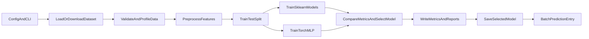

# 🚀 Technical Design: Customer Churn ML Pipeline

## 🧭 Overview

This repository implements a local training workflow for customer churn prediction on the IBM Telco Customer Churn dataset.

The scope is intentionally narrow: one dataset, one training entrypoint, a small set of candidate models, and reproducible run artifacts. The design goal is to keep the training path easy to inspect, rerun, and extend without pretending to be a production ML platform.

## 🧰 What It Covers

- dataset ingestion
- schema and data-quality validation
- shared preprocessing
- sklearn and PyTorch training paths
- Ray Tune hyperparameter search
- model comparison and selection
- drift monitoring between runs
- run artifact generation
- batch prediction from saved artifacts

## 🗂️ Dataset

- dataset: IBM Telco Customer Churn
- task: binary classification
- target: `Churn`

This dataset is a good fit for a compact training pipeline: public, tabular, and small enough for local iteration while still requiring realistic preprocessing and evaluation decisions.

## 🛰️ System Flow

Main path: config -> ingestion -> validation -> preprocessing -> split -> train -> compare -> artifacts -> prediction.

## 🧩 Main Components

### 1. 📥 Ingestion

The training command either downloads the source CSV from a public URL or reads a local dataset path from config.

Each run stores its own dataset snapshot under `outputs/runs/<run_id>/dataset.csv`. `outputs/dataset.csv` is updated as the latest local copy.

### 2. ✅ Validation

Validation runs before training. It checks:

- required columns exist
- `customerID` is unique
- `Churn` is present and non-null
- numeric columns can be coerced cleanly
- key categorical columns only contain expected values

Each run also writes a `data_quality_report.json` containing row counts, missing counts, missing rates, numeric coercion results, category sanity checks, and target distribution.

The validation layer is intentionally lightweight, but it creates a clear boundary between "accepted for training" and "rejected before training."

### 3. 🧼 Preprocessing

Features are split by type:

- numeric features: median imputation + standard scaling
- categorical features: most-frequent imputation + one-hot encoding

The preprocessing logic is shared across model families so the comparison stays fair and saved artifacts stay consistent with training-time transformations.

### 4. 🏋️ Model Training

Current candidates:

- `logistic_regression`
- `random_forest`
- `torch_mlp`

The sklearn models are wrapped in pipelines that include preprocessing. The PyTorch model reuses the same fitted preprocessor, converts the transformed features into dense tensors, and trains a small feedforward network.

The PyTorch path includes:

- an internal validation split
- early stopping on validation loss
- restoration of the best validation checkpoint

This makes the neural baseline easier to discuss in terms of overfitting and training stability.

### 5. 🔧 Hyperparameter Tuning

When tuning is enabled, the pipeline uses Ray Tune to search hyperparameters for the sklearn models before final training. Each trial runs stratified cross-validation on the training set and reports F1. The best parameters are merged back into the config so the final models use tuned values.

Search spaces:

- `logistic_regression`: `C` (loguniform 0.01–10)
- `random_forest`: `n_estimators`, `max_depth`, `min_samples_leaf`

The search uses random sampling (20 trials by default). Ray parallelizes trials across available CPU cores.

The torch model is not tuned — it uses fixed config and serves as a framework-integration baseline.

### 6. 📊 Drift Monitoring

After validation, the pipeline compares the current run's data quality report with the previous run's. It checks:

- row count changes (flagged if >10% change)
- target distribution shift (flagged if positive rate changes by >5%)
- per-column missing rate changes (flagged if any column changes by >1%)

The drift report is saved per-run. If there is no previous run, drift monitoring is skipped.

### 7. 📏 Evaluation

All models report the same metrics:

- accuracy
- precision
- recall
- f1
- roc_auc

Model selection uses held-out test-set F1.

For the sklearn baselines, the pipeline also records stratified cross-validation statistics on the training split. For the selected model, it writes a `threshold_report.json` showing how precision, recall, accuracy, and F1 change as the classification threshold moves.

This separates two decisions that are often conflated:

- which model is best
- which prediction threshold is best for a given trade-off

### 8. 📦 Artifacts

Each run writes a timestamped directory under `outputs/runs/<run_id>/` with:

- `dataset.csv`
- `metrics.json`
- `run_summary.json`
- `data_quality_report.json`
- `threshold_report.json`
- `manifest.json`
- the selected model artifact

The repository also keeps latest-run pointers at the top level:

- `outputs/metrics.json`
- `outputs/run_summary.json`
- `outputs/threshold_report.json`
- `outputs/manifest.json`
- `outputs/best_model.pkl` or `outputs/best_model.pt`

The manifest records config values, selected model, artifact paths, and dependency versions so a run can be traced without opening code.

### 9. 🔮 Prediction Path

The repository includes a batch prediction entrypoint that loads a saved model artifact and writes predictions for an input CSV.

The output preserves the original rows and adds:

- `churn_probability`
- `predicted_churn`

This is intentionally simple, but it closes the loop between training and downstream consumption.

## 📊 Current Run Snapshot

Latest run summary:

- dataset rows: `7043`
- train rows: `5634`
- test rows: `1409`
- target positive rate: `0.2654`
- selected model: `random_forest`
- selected framework: `scikit-learn`
- selection metric: `f1`
- tuning: Ray Tune random search, 20 trials per sklearn model

Held-out test metrics:

| Model | Accuracy | Precision | Recall | F1 | ROC AUC |
| --- | ---: | ---: | ---: | ---: | ---: |
| `logistic_regression` | 0.7445 | 0.5123 | 0.7807 | 0.6186 | 0.8397 |
| `random_forest` | 0.7658 | 0.5420 | 0.7594 | 0.6325 | 0.8428 |
| `torch_mlp` | 0.7424 | 0.5098 | 0.7647 | 0.6118 | 0.8363 |

Additional notes:

- all models use `class_weight="balanced"` (or equivalent `pos_weight` for PyTorch), trading accuracy for recall
- sklearn hyperparameters are tuned via Ray Tune; the torch model uses fixed config as a baseline
- `random_forest` leads on both held-out F1 and cross-validation F1 mean
- the selected model's best F1 threshold is `0.45`, close to the default `0.5`
- the PyTorch baseline benefited from validation-based checkpoint selection but still did not beat the sklearn models

## ⚖️ Main Trade-off

The main trade-off was speed of implementation vs modularity and traceability.

A single notebook or single script would have been faster. Instead, the workflow is split into explicit stages with config-driven execution, per-run artifacts, threshold analysis, and a prediction path. That adds some structure, but it also makes the system easier to inspect, debug, rerun, and extend.

## 🛠️ Operational Support

The repository includes a few lightweight engineering features around the training path:

- unit tests and a smoke test
- GitHub Actions CI
- a Dockerfile for reproducible execution

These do not make the project production-ready, but they do make it more credible as an ML engineering artifact.

## 🧭 Next Improvements

- probability calibration
- richer drift reporting (feature-level distribution tests)
- API-based inference endpoint
- learning-rate scheduling for PyTorch path

## 🧾 Summary

This project is intentionally small, but the structure is deliberate. It demonstrates a complete local training workflow with validation, shared preprocessing, cross-framework model comparison, explicit artifacts, threshold analysis, and a simple prediction path.
